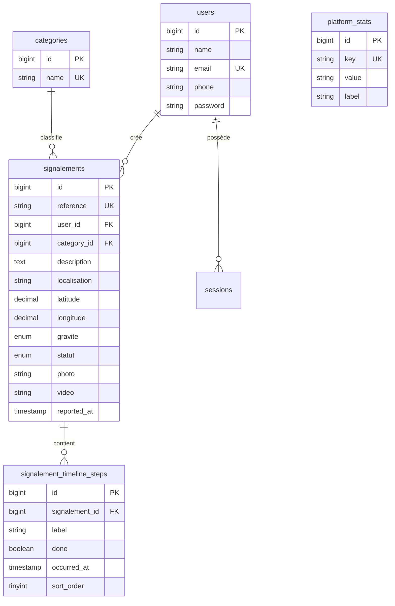

# Smart Emergency AI

Application web de signalement d'urgences pour les citoyens du **Niger** (Niamey). Les utilisateurs peuvent créer un compte, signaler une urgence avec géolocalisation GPS, joindre une photo ou une vidéo, et suivre l'état de leurs signalements via une timeline d'intervention.

---

## Table des matières

- [Fonctionnalités](#fonctionnalités)
- [Stack technique](#stack-technique)
- [Prérequis](#prérequis)
- [Installation](#installation)
- [Configuration](#configuration)
- [Base de données](#base-de-données)
- [Schéma des tables](#schéma-des-tables)
- [Relations entre tables](#relations-entre-tables)
- [Routes et pages](#routes-et-pages)
- [Structure du projet](#structure-du-projet)
- [Compte de démonstration](#compte-de-démonstration)
- [Upload de médias](#upload-de-médias)
- [Commandes utiles](#commandes-utiles)

---

## Fonctionnalités

### Espace public
- Page d'accueil avec présentation de la plateforme, statistiques et sections informatives
- Accès sans connexion à la landing page

### Authentification
- Inscription et connexion par e-mail / mot de passe
- Sessions persistées en base de données
- Déconnexion sécurisée

### Espace citoyen (authentifié)
- **Dashboard** — vue d'ensemble des signalements récents
- **Signaler une urgence** — formulaire complet avec catégorie, description, GPS, photo et vidéo
- **Historique** — liste filtrable de tous les signalements de l'utilisateur
- **Détail d'un signalement** — timeline d'intervention, carte Google Maps, médias joints

### Fonctionnalités techniques
- Géolocalisation navigateur (GPS) + reverse geocoding via OpenStreetMap (Nominatim)
- Détermination automatique de la gravité selon la catégorie
- Upload photo (max. 5 Mo) et vidéo (max. 20 Mo)
- Interface responsive Bootstrap 5 avec thème clair / sombre
- Messages d'erreur et interface en **français**

---

## Stack technique

| Couche | Technologie |
|--------|-------------|
| Backend | PHP 8.3+, Laravel 13 |
| Base de données | MySQL (recommandé) ou SQLite |
| Frontend | Blade, Bootstrap 5, Bootstrap Icons |
| JavaScript | Vanilla JS (`public/js/smart-emergency.js`) |
| Styles | CSS personnalisé (`public/css/smart-emergency.css`) |
| Auth | Laravel Session (driver `database`) |
| Cache / Queue | Driver `database` |
| Stockage fichiers | `storage/app/public` (disque `public`) |

---

## Prérequis

- PHP >= 8.3 avec extensions : `pdo`, `pdo_mysql` (ou `pdo_sqlite`), `mbstring`, `openssl`, `fileinfo`
- Composer
- MySQL 8+ (ou SQLite pour un test rapide)
- Node.js et npm (optionnel, si vous utilisez Vite)

---

## Installation

```bash
# 1. Cloner le dépôt
git clone <url-du-repo> smartEmergency
cd smartEmergency

# 2. Installer les dépendances PHP
composer install

# 3. Copier le fichier d'environnement
cp .env.example .env

# 4. Générer la clé d'application
php artisan key:generate

# 5. Configurer la base de données dans .env (voir section Configuration)

# 6. Créer la base MySQL (si applicable)
# CREATE DATABASE smart_emergency_ai CHARACTER SET utf8mb4 COLLATE utf8mb4_unicode_ci;

# 7. Exécuter les migrations et le seeder
php artisan migrate --force
php artisan db:seed --force

# 8. Lier le stockage public (photos / vidéos)
php artisan storage:link

# 9. Créer le dossier temporaire PHP du projet
mkdir storage/tmp
```

---

## Configuration

Exemple de configuration `.env` pour MySQL :

```env
APP_NAME="Smart Emergency AI"
APP_ENV=local
APP_DEBUG=true
APP_URL=http://localhost:8000

APP_LOCALE=fr
APP_FALLBACK_LOCALE=fr

DB_CONNECTION=mysql
DB_HOST=127.0.0.1
DB_PORT=3306
DB_DATABASE=smart_emergency_ai
DB_USERNAME=root
DB_PASSWORD=votre_mot_de_passe

SESSION_DRIVER=database
CACHE_STORE=database
QUEUE_CONNECTION=database
FILESYSTEM_DISK=local
```

Pour SQLite (développement rapide) :

```env
DB_CONNECTION=sqlite
# DB_DATABASE sera database/database.sqlite
```

---

## Base de données

Le projet contient **14 tables** réparties en deux groupes :

| Groupe | Tables |
|--------|--------|
| **Métier** | `users`, `categories`, `signalements`, `signalement_timeline_steps`, `platform_stats` |
| **Laravel (framework)** | `sessions`, `password_reset_tokens`, `cache`, `cache_locks`, `jobs`, `job_batches`, `failed_jobs` |

### Données initiales (seeder)

Le seeder `SmartEmergencySeeder` insère :

- 1 utilisateur de démo
- 6 catégories d'urgence
- 6 signalements d'exemple (SIG-001 à SIG-006)
- 3 statistiques plateforme

```bash
php artisan db:seed --class=SmartEmergencySeeder
```

---

## Schéma des tables

### `users`

Comptes citoyens de la plateforme.

| Colonne | Type | Contraintes | Description |
|---------|------|-------------|-------------|
| `id` | `BIGINT UNSIGNED` | PK, auto-increment | Identifiant unique |
| `name` | `VARCHAR(255)` | NOT NULL | Nom complet |
| `email` | `VARCHAR(255)` | NOT NULL, UNIQUE | Adresse e-mail |
| `phone` | `VARCHAR(20)` | NULLABLE | Numéro de téléphone (+227…) |
| `email_verified_at` | `TIMESTAMP` | NULLABLE | Date de vérification e-mail |
| `password` | `VARCHAR(255)` | NOT NULL | Mot de passe hashé (bcrypt) |
| `remember_token` | `VARCHAR(100)` | NULLABLE | Jeton « Se souvenir de moi » |
| `created_at` | `TIMESTAMP` | NULLABLE | Date de création |
| `updated_at` | `TIMESTAMP` | NULLABLE | Date de mise à jour |

---

### `categories`

Types d'urgences signalables.

| Colonne | Type | Contraintes | Description |
|---------|------|-------------|-------------|
| `id` | `BIGINT UNSIGNED` | PK, auto-increment | Identifiant unique |
| `name` | `VARCHAR(255)` | NOT NULL, UNIQUE | Nom de la catégorie |
| `created_at` | `TIMESTAMP` | NULLABLE | Date de création |
| `updated_at` | `TIMESTAMP` | NULLABLE | Date de mise à jour |

**Valeurs seedées :** Incendie, Accident, Agression, Inondation, Coupure électrique, Urgence médicale.

---

### `signalements`

Signalements d'urgence créés par les citoyens.

| Colonne | Type | Contraintes | Description |
|---------|------|-------------|-------------|
| `id` | `BIGINT UNSIGNED` | PK, auto-increment | Identifiant interne |
| `reference` | `VARCHAR(20)` | NOT NULL, UNIQUE | Référence publique (ex. `SIG-001`) |
| `user_id` | `BIGINT UNSIGNED` | FK → `users.id`, CASCADE | Auteur du signalement |
| `category_id` | `BIGINT UNSIGNED` | FK → `categories.id`, CASCADE | Catégorie d'urgence |
| `description` | `TEXT` | NOT NULL | Description détaillée |
| `localisation` | `VARCHAR(255)` | NOT NULL | Adresse textuelle |
| `latitude` | `DECIMAL(10,7)` | NULLABLE | Latitude GPS |
| `longitude` | `DECIMAL(10,7)` | NULLABLE | Longitude GPS |
| `gravite` | `ENUM` | NOT NULL | `critique`, `elevee`, `moyenne`, `faible` |
| `statut` | `ENUM` | DEFAULT `en_cours` | `en_cours`, `termine` |
| `photo` | `VARCHAR(255)` | NULLABLE | Chemin public de la photo |
| `video` | `VARCHAR(255)` | NULLABLE | Chemin public de la vidéo |
| `reported_at` | `TIMESTAMP` | NOT NULL | Date/heure du signalement |
| `created_at` | `TIMESTAMP` | NULLABLE | Date de création |
| `updated_at` | `TIMESTAMP` | NULLABLE | Date de mise à jour |

**Règles de gravité automatique :**

| Catégorie | Gravité |
|-----------|---------|
| Incendie, Urgence médicale | `critique` |
| Accident, Agression, Inondation | `elevee` |
| Coupure électrique | `moyenne` |

---

### `signalement_timeline_steps`

Étapes de suivi d'intervention pour chaque signalement.

| Colonne | Type | Contraintes | Description |
|---------|------|-------------|-------------|
| `id` | `BIGINT UNSIGNED` | PK, auto-increment | Identifiant unique |
| `signalement_id` | `BIGINT UNSIGNED` | FK → `signalements.id`, CASCADE | Signalement parent |
| `label` | `VARCHAR(255)` | NOT NULL | Libellé de l'étape |
| `done` | `BOOLEAN` | DEFAULT `false` | Étape terminée ou non |
| `occurred_at` | `TIMESTAMP` | NULLABLE | Date/heure de l'étape |
| `sort_order` | `TINYINT UNSIGNED` | DEFAULT `0` | Ordre d'affichage |
| `created_at` | `TIMESTAMP` | NULLABLE | Date de création |
| `updated_at` | `TIMESTAMP` | NULLABLE | Date de mise à jour |

**Étapes par défaut à la création :**

1. Signalement reçu
2. Analyse IA terminée
3. Intervention en cours
4. Intervention clôturée

---

### `platform_stats`

Statistiques affichées sur la page d'accueil.

| Colonne | Type | Contraintes | Description |
|---------|------|-------------|-------------|
| `id` | `BIGINT UNSIGNED` | PK, auto-increment | Identifiant unique |
| `key` | `VARCHAR(255)` | NOT NULL, UNIQUE | Clé technique |
| `value` | `VARCHAR(255)` | NOT NULL | Valeur affichée |
| `label` | `VARCHAR(255)` | NOT NULL | Libellé affiché |
| `created_at` | `TIMESTAMP` | NULLABLE | Date de création |
| `updated_at` | `TIMESTAMP` | NULLABLE | Date de mise à jour |

**Valeurs seedées :**

| `key` | `value` | `label` |
|-------|---------|---------|
| `urgences_traitees` | `120` | Urgences traitées |
| `taux_succes` | `95%` | Taux de succès |
| `temps_moyen` | `12 min` | Temps moyen d'intervention |

---

### `sessions`

Sessions utilisateur (driver `database`).

| Colonne | Type | Contraintes | Description |
|---------|------|-------------|-------------|
| `id` | `VARCHAR(255)` | PK | Identifiant de session |
| `user_id` | `BIGINT UNSIGNED` | NULLABLE, INDEX, FK → `users.id` | Utilisateur connecté |
| `ip_address` | `VARCHAR(45)` | NULLABLE | Adresse IP |
| `user_agent` | `TEXT` | NULLABLE | Navigateur / appareil |
| `payload` | `LONGTEXT` | NOT NULL | Données de session sérialisées |
| `last_activity` | `INTEGER` | INDEX | Timestamp dernière activité |

---

### `password_reset_tokens`

Jetons de réinitialisation de mot de passe.

| Colonne | Type | Contraintes | Description |
|---------|------|-------------|-------------|
| `email` | `VARCHAR(255)` | PK | E-mail concerné |
| `token` | `VARCHAR(255)` | NOT NULL | Jeton de réinitialisation |
| `created_at` | `TIMESTAMP` | NULLABLE | Date de création |

---

### `cache`

Stockage du cache applicatif (driver `database`).

| Colonne | Type | Contraintes | Description |
|---------|------|-------------|-------------|
| `key` | `VARCHAR(255)` | PK | Clé de cache |
| `value` | `MEDIUMTEXT` | NOT NULL | Valeur sérialisée |
| `expiration` | `BIGINT` | INDEX | Timestamp d'expiration |

---

### `cache_locks`

Verrous distribués pour le cache.

| Colonne | Type | Contraintes | Description |
|---------|------|-------------|-------------|
| `key` | `VARCHAR(255)` | PK | Clé du verrou |
| `owner` | `VARCHAR(255)` | NOT NULL | Propriétaire du verrou |
| `expiration` | `BIGINT` | INDEX | Timestamp d'expiration |

---

### `jobs`

File d'attente des tâches asynchrones.

| Colonne | Type | Contraintes | Description |
|---------|------|-------------|-------------|
| `id` | `BIGINT UNSIGNED` | PK, auto-increment | Identifiant unique |
| `queue` | `VARCHAR(255)` | INDEX | Nom de la file |
| `payload` | `LONGTEXT` | NOT NULL | Job sérialisé |
| `attempts` | `SMALLINT UNSIGNED` | NOT NULL | Nombre de tentatives |
| `reserved_at` | `INTEGER UNSIGNED` | NULLABLE | Réservation |
| `available_at` | `INTEGER UNSIGNED` | NOT NULL | Disponible à partir de |
| `created_at` | `INTEGER UNSIGNED` | NOT NULL | Date de création |

---

### `job_batches`

Lots de jobs groupés.

| Colonne | Type | Contraintes | Description |
|---------|------|-------------|-------------|
| `id` | `VARCHAR(255)` | PK | Identifiant du lot |
| `name` | `VARCHAR(255)` | NOT NULL | Nom du lot |
| `total_jobs` | `INTEGER` | NOT NULL | Nombre total de jobs |
| `pending_jobs` | `INTEGER` | NOT NULL | Jobs en attente |
| `failed_jobs` | `INTEGER` | NOT NULL | Jobs échoués |
| `failed_job_ids` | `LONGTEXT` | NOT NULL | IDs des jobs échoués |
| `options` | `MEDIUMTEXT` | NULLABLE | Options du lot |
| `cancelled_at` | `INTEGER` | NULLABLE | Annulation |
| `created_at` | `INTEGER` | NOT NULL | Date de création |
| `finished_at` | `INTEGER` | NULLABLE | Date de fin |

---

### `failed_jobs`

Jobs ayant échoué définitivement.

| Colonne | Type | Contraintes | Description |
|---------|------|-------------|-------------|
| `id` | `BIGINT UNSIGNED` | PK, auto-increment | Identifiant unique |
| `uuid` | `VARCHAR(255)` | UNIQUE | UUID du job |
| `connection` | `VARCHAR(255)` | NOT NULL | Connexion queue |
| `queue` | `VARCHAR(255)` | NOT NULL | File d'attente |
| `payload` | `LONGTEXT` | NOT NULL | Job sérialisé |
| `exception` | `LONGTEXT` | NOT NULL | Trace d'erreur |
| `failed_at` | `TIMESTAMP` | DEFAULT CURRENT | Date d'échec |

---

## Relations entre tables



---

## Routes et pages

| Méthode | URL | Nom | Accès | Description |
|---------|-----|-----|-------|-------------|
| GET | `/` | `home` | Public | Page d'accueil |
| GET | `/connexion` | `login` | Invité | Formulaire de connexion |
| POST | `/connexion` | — | Invité | Traitement connexion |
| GET | `/inscription` | `register` | Invité | Formulaire d'inscription |
| POST | `/inscription` | — | Invité | Traitement inscription |
| POST | `/deconnexion` | `logout` | Auth | Déconnexion |
| GET | `/dashboard` | `dashboard` | Auth | Tableau de bord |
| GET | `/signaler` | `report` | Auth | Formulaire de signalement |
| POST | `/signaler` | `signalement.store` | Auth | Enregistrement signalement |
| GET | `/geolocalisation/adresse` | `geolocate.address` | Auth | Reverse geocoding (JSON) |
| GET | `/historique` | `history` | Auth | Historique des signalements |
| GET | `/signalement/{id}` | `signalement.show` | Auth | Détail d'un signalement |

---

## Structure du projet

```
smartEmergency/
├── app/
│   ├── Console/Commands/
│   │   └── ServeApplicationCommand.php   # Serveur dev avec config upload PHP
│   ├── Http/Controllers/
│   │   ├── AuthController.php            # Connexion, inscription, déconnexion
│   │   ├── PageController.php            # Pages vues (home, dashboard, etc.)
│   │   └── SignalementController.php     # Création signalement + géoloc
│   ├── Models/
│   │   ├── User.php
│   │   ├── Category.php
│   │   ├── Signalement.php
│   │   ├── SignalementTimelineStep.php
│   │   └── PlatformStat.php
│   └── Providers/
│       └── AppServiceProvider.php
├── bootstrap/
│   ├── app.php
│   └── environment.php                   # Dossier temporaire PHP du projet
├── database/
│   ├── migrations/                       # Schéma BDD (14 tables)
│   └── seeders/
│       ├── DatabaseSeeder.php
│       └── SmartEmergencySeeder.php
├── lang/fr/                              # Traductions françaises
├── public/
│   ├── css/smart-emergency.css
│   ├── js/smart-emergency.js
│   └── storage/                          # Lien symbolique → storage/app/public
├── resources/views/
│   ├── layouts/app.blade.php
│   ├── partials/                         # navbar, alerts, sidebar
│   └── pages/                            # home, login, register, dashboard,
│                                         # report, history, show
├── routes/web.php
├── server.php                            # Routeur serveur PHP intégré
├── serve.ps1                             # Script PowerShell de démarrage
└── storage/
    ├── app/public/signalements/
    │   ├── photos/
    │   └── videos/
    └── tmp/                              # Fichiers temporaires PHP
```

---

## Compte de démonstration

| Champ | Valeur |
|-------|--------|
| E-mail | `ben.said@email.ne` |
| Mot de passe | `password` |
| Téléphone | `+227 87 14 51 44` |

---

## Upload de médias

| Type | Formats acceptés | Taille max. | Stockage |
|------|------------------|-------------|----------|
| Photo | JPEG, PNG, GIF, WebP, BMP, HEIC, HEIF | 5 Mo | `storage/app/public/signalements/photos/` |
| Vidéo | MP4, MOV, AVI, WebM, 3GP, MKV, M4V | 20 Mo | `storage/app/public/signalements/videos/` |

Le serveur de développement configure automatiquement le dossier temporaire PHP (`storage/tmp`) et les limites d'upload via `php artisan serve`.

Alternative PowerShell :

```powershell
.\serve.ps1
```

---

## Commandes utiles

```bash
# Démarrer le serveur de développement
php artisan serve

# Migrations
php artisan migrate
php artisan migrate:fresh --seed

# Lien stockage public
php artisan storage:link

# Vider le cache
php artisan config:clear
php artisan cache:clear
php artisan view:clear

# Lancer les tests
php artisan test
```

---

## Licence

Projet basé sur le framework [Laravel](https://laravel.com), sous licence [MIT](https://opensource.org/licenses/MIT).
